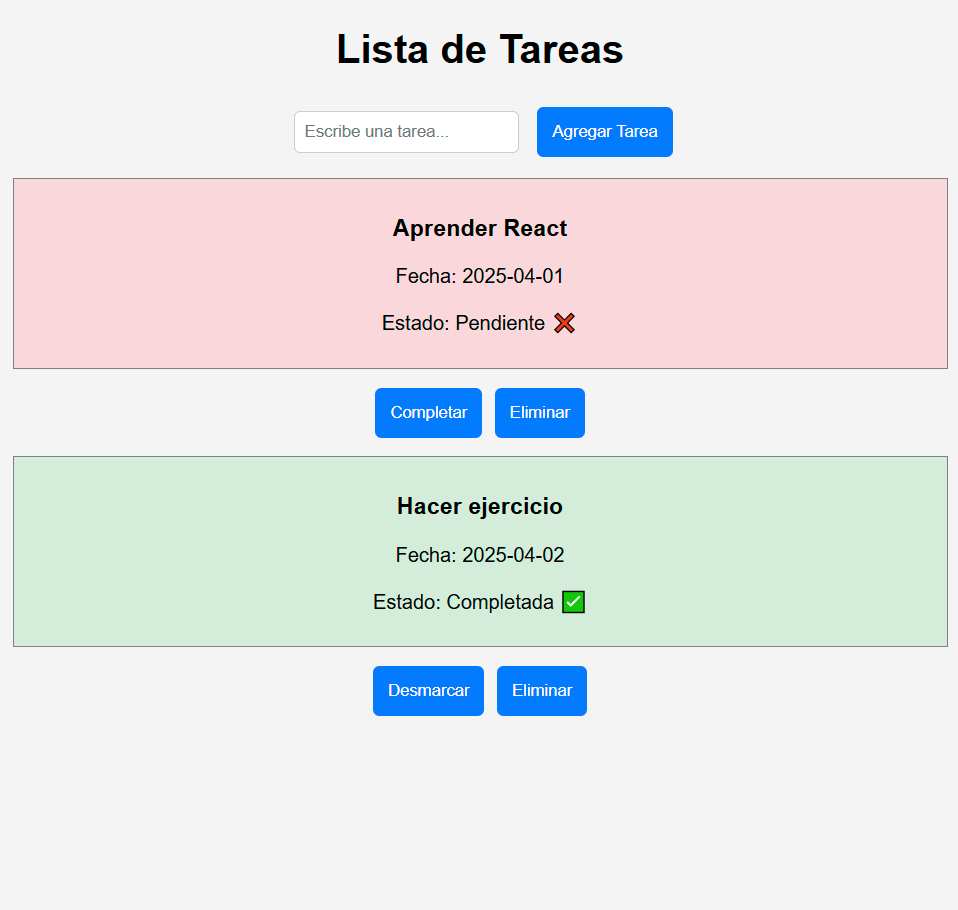

# Lista de Tareas - Proyecto en React

Este proyecto es una aplicación de lista de tareas desarrollada con **React**, permitiendo a los usuarios agregar, marcar como completadas y eliminar tareas de manera interactiva.

El objetivo de este proyecto es demostrar el uso de **componentes reutilizables**, manejo de **estado con hooks (useState)** y eventos en React, ofreciendo una experiencia fluida e intuitiva para la gestión de tareas diarias.

## Características

- **Agregar tareas** con un input y un botón.
- **Visualizar tareas** con su nombre, fecha y estado.
- **Marcar tareas como completadas** y desmarcarlas si es necesario.
- **Eliminar tareas** de la lista.
- **Diseño simple y claro**, con cambios visuales según el estado de la tarea.

## Tecnologías Utilizadas

- React
- JavaScript (ES6+)
- CSS3
- Git & GitHub

## Instalación y Uso

1. Clonar el repositorio:
   ```bash
   git clone https://github.com/isaan86/lista-de-tareas.git
   ```
2. Acceder al directorio del proyecto:
   ```bash
   cd lista-de-tareas
   ```
3. Instalar dependencias:
   ```bash
   npm install
   ```
4. Ejecutar la aplicación en modo desarrollo:
   ```bash
   npm start
   ```

La aplicación estará disponible en `http://localhost:3000`.

## Capturas de Pantalla



## Contacto

Para cualquier consulta, oportunidad laboral o colaboración, no dudes en contactarme:

- **Nombre:** Alexandra Ferrera
- **LinkedIn:** [Mi LinkedIn](https://www.linkedin.com/in/alexandra-ferrera-arenas/)
- **Correo Electrónico:** [sandraferreraarenas@gmail.com](mailto:sandraferreraarenas@gmail.com)
- **Portafolio:** [Alexandra Ferrera - Desarrolladora Frontend & UX/UI](https://alexandra-ferrera-portfolio.netlify.app/)

#react #frontenddeveloper #webdevelopment #javascript #tasksapp #uxui

